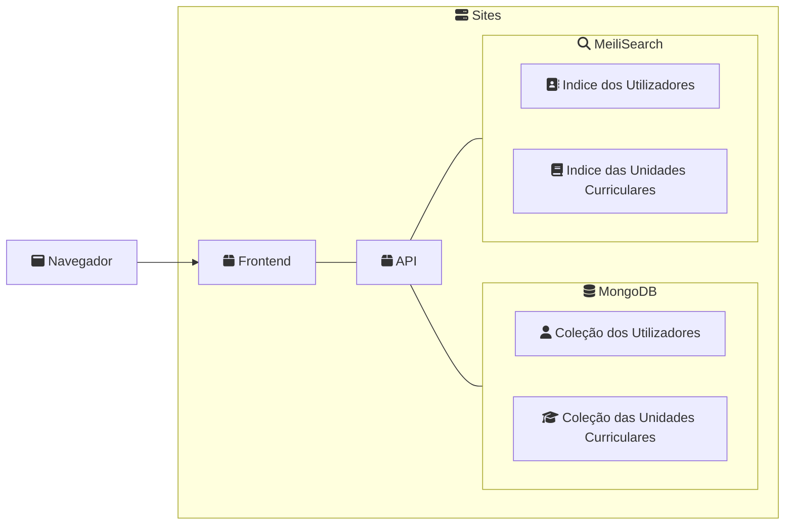
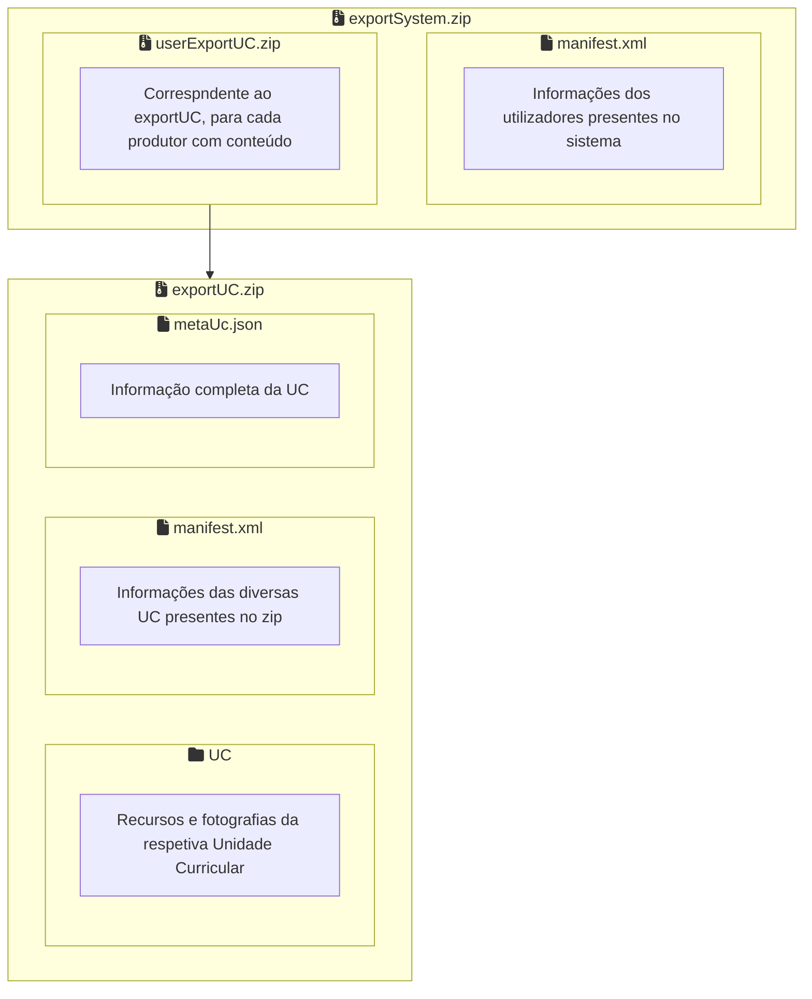

# EW -Engenharia Web

## Projeto: Gerador de Páginas UC

### Membros:

- A94877  [Diogo Cardoso Ferreira]
- A100695 [Guilherme João Fernandes Barbosa]
- A96807  [Rafael Conde Peixoto]
- A101759 [Rui Pedro Pádua Gonçalves]

### Introdução

O projeto desenvolvido pelo grupo foi o *Gerador de Páginas UC*. A escolha desta proposta foi influenciada principalmente pelo estado atual da BlackBoard e por algumas conversas com a equipa docente.

A implementação desta proposta recorreu a diversas ferramentas, tais como **Pug**, **Express** e **MongoDB**, as quais serão abordadas posteriormente. Através destas ferramentas implementamos diversas funcionalidades, tais como autenticação, gestão de dados, armazenamento de ficheiros, renderização de alguns tipos de recurrsos, pesquisa sobre as diferentes UC e utilizadores e, por fim, foram implementados testes ponta-a-ponta (E2E), de forma a garantir o bom funcionamento de toda a aplicação.

### Arquitetura da aplicação

A arquitetura da aplicação desenvolvida possui o seguinte formato:

- A interface com a qual o utilizador interage.
- Um servidor que recebe os pedidos feitos através desta interface e é responsável por renderizar o **Pug** desenvolvido, enviando o resultado final para o cliente.
- Um servidor que comunica com a base de dados e fornece os dados e ficheiros necessários para satisfazer os pedidos recebidos.
- Uma base de dados em MongoDB.
- Um motor de pesquisa em Meili.

A arquitetura possui o seguinte aspeto:

### Ferramentas utilizadas

Tal como referido, o grupo recorreu a diversas ferramentas para desenvolver a aplicação apresentada. As ferramentas que mais se destacam são:

- Express: utilizado para abstrair a complexidade dos módulos de *HTTP* do *Node* e assim facilitar o processo de desenvolvimento da API e do front-end
- Meili: motor de pesquisa utilizado para assegurar a melhor experiência possível de pesquisa, utilizando na mesma o conteúdo introduzido pelos utilizadores
- MongoDB: base de dados da aplicação onde estão guardadas as informações respetivas aos utilizadores e às unidades curriculares criadas
- Pug: utilizado para a criação dos templates das diversas páginas web disponibilizadas pela aplicação
- CSS: utilizado para definir os estilo com o qual as diferentes páginas são apresentadas
- RSS: protocolo utilizado para munir os utilizadores de um sistema de notificações para os anúncios das unidades curriculares onde estam inscritos
- Scratch: ferramenta usada na renderização de arquivos sb3
- Ruffle: permite a renderização de arquivos swf (Adobe Flash)
- Cypress: ferramenta de testes de ponta a ponta utilizados para garantir o bom funcionamento da aplicação desenvolvida
- PDF.JS: utilizado na renderização de arquivos PDF
- Docker: permite uma forma fácil de executar o serviço desenvolvido num ambiente sem variáveis externas

### Funcionalidades desenvolvidas

#### Autenticação

A autenticação desenvolvida pelo grupo é bastante inspirada na autenticação lecionada nas aulas, sendo a principal diferença o facto de não utilizarmos **Express-Session** e **Passport.JS**. Contudo ainda utilizamos o *Json Web Token* como forma de autenticação, o qual é armazenado no lado do cliente como um *cookie http*. Sempre que um cliente faz um pedido, esse token é enviado junto do mesmo e é verificada a sua validade tanto no front-end como no back-end, quando se recorre a este último.

#### Importação e Exportação de conteúdos do sistema

Os SIP e DIP mereceram especial atenção por parte do grupo. Visto existirem diferentes conteúdos aos quais os utilizadores têm acesso, foi decidido que um DIP conteria apenas os dados relacionados às UC e aos utilizadores sobre os quais o cliente atual possui liberdade de edição. Assim, um *Produtor* pode exportar as UC por si criadas, juntamente com todos os dados e ficheiros relacionados com as mesmas, e um *Administrador* possui duas opções. A primeira é uma exportação do nível de um *Produtor*, enquanto que a segunda é a exportação do sistema completo, isto é, de todas as UC presentes no site e de todos os utilizadores registados.

Devido a esta dualidade de exportação de um administrador, foi necessário refletir a mesma no momento da importação de um SIP. Desta forma, um *Produtor* pode importar os dados referentes às suas UC, enquanto que um *Administrador* pode realizar o mesmo procedimento ou importar os dados referentes ao site completo.

O formato dos referidos SIP e DIP é:

#### Base de dados

A nível da gestão dos dados, o grupo decidiu criar duas entidades diferentes. A primeira, a qual representa um utilizador do sistema, possui os campos *nome*, *email*, *password*, *filiação*, *nivel* (define as permissões do utilizador), *creationDate* (data de criação da conta) e *accessDate* (data de último acesso ao site), sendo que todos são obrigatórios.

A segunda entidade definida é a que representa uma UC. Possui os campos *_id*, *titulo*, *docentes*, *horario*, *avaliacao* (lista de *String*), *datas*, *aulas*, *anuncios*, *resources*, *producer* e *users*. O campo docentes representa uma lista de entidades *docente*, as quais possuem os campos *nome*, *foto* (o nome da foto do docente), *categoria*, *filiacao*, *email* e *webpage*. O campo *horario* possui duas listas que representam os horários das aulas teóricas (campo *teoricas*) e das aulas práticas (campo *praticas*). O campo *datas* representa uma lista de datas importantes na UC, sendo que cada entidade desta lista possui os campos *nome* e *descricao*. O campo *aulas* representa também ele uma lista. Esta é populada por entidades que possuem os campos *tipo*, *data* e *sumario* e que simbolizam a datação e sumarização de uma aula. Os anúncios são entidades que possuem os campos *data*, *titulo* e *descricao*, sendo este último uma lista de *string*, e são a implementação do conceito de anúncios emitidos numa UC. Por fim, o campo *resources* simboliza a lista de recursos disponibilizados na UC, sendo que cada entidade desta lista possui os campos *_id*, *originalFilename*, *titulo* e *descricao*.

#### Pesquisa

A pesquisa das diversas UC e dos vários utilizadores é fundamental e o seu papel é evidenciado quando a população destas entidades é extensa. Neste sentido, a pesquisa deve ser eficiente tanto a nível de velocidade como a nível de espaço. Por estes motivos, e considerando o facto de que erros de escrita podem ser introduzidos despropositadamente, optamos por recorrer ao **MeiliSearch** na nossa implementação desta funcionalidade.

Visto este motor de pesquisa ter sido escrito em Rust, os requisitos de eficiência estão assegurados. Por outro lado, é uma ferramente bastante customizável, o que permite projetar as colunas que desejamos filtrar, bem como definir os pesos de cada uma destas colunas durante a filtragem, pelo que o motor responde em milisegundos. A comunicação com o motor ocorre através de uma *API* desenvolvida pelo grupo, a qual reencaminha os pedidos para o servidor do *Meili* por *HTTP*.

A integração deste motor com a aplicação permite que, em determinadas páginas, o utilizador forneça um filtro, introduzido numa caixa de texto bem sinalizada, e, em tempo real, os resultados da pesquisa são atualizados.

#### Sistema de notificações

Uma funcionalidade que o grupo considerou pertinente foi a implementação de um sistema de notificações de anúncios, à semelhança do que acontece na *Blackboard*. Para tal, recorreu a mais uma ferramenta, a qual segue os standards Atom e RSS 2 da w3c. Estes standards são amplamente utilizados em diversas ferramentas, tais como o Google News, alertando os utilizadores do lançamento de novas atividades ou informações no seu feed.

#### Renderização de recursos

Uma outra funcionalidade extra que o grupo implementou foi a renderização de diversos recursos publicados nas várias UC. Esta funcionalidade surgiu com o objetivo de permitir que os utilizadores não se desloquem da plataforma para abrir os recursos disponibilizados. O grupo optou por uma integração opcional, isto é, o administrador deve indicar quais recursos serão renderizadas, sendo esta escolha disponibilizada no painel de configurações do site. É possível renderizar recursos com formato PDF, visto ser um dos formatos mais comuns, Scratch (sb3) e Adobe Flash, sendo a inclusão destes últimos devida a um sentimento de nostalgia do diversos membros do grupo.

Com a exeção do PDF.JS, os restantes renderizadores utilizados não podem ser copiados diretamente para o projeto para serem utilizados, pelo que se recurreu a um bundler, nomeadamente o Webpack, o qual empacota as dependências e torna possível aceder ao referidos renderizadores através da interface do cliente. No caso do scratch foram usados pacotes disponibilizados pela fundação *Scratch*, os quais estão disponíveis no *npm.js*. Já para recursos com formato Flash, formato que já não é suportado nem pela Adobe nem pelos diversos browsers, recurreu-se ao Ruffle, que é um emulador desenvolvido pela comunidade.

#### Testes E2E

Para garantir que pequenas modificações no código existente não causavam situações inesperadas em funcionalidades já implementadas, é necessário realizar uma bateria de testes. Para tornar este processo mais eficiente, estes testes podem ser automatizados e são executados após cada uma das modificações referidas. 

Para implementar a referida bateria de testes, o grupo recorreu ao *cypress*, o qual permite utilizar os diversos elementos das páginas web para garantir que os testes cobrem toda a experiência do utilizador, desde que este entra na aplicação até que sai da mesma. Esta ferramenta foi escolhida devido à sua reduzida curva de aprendizagem, à velocidade dos testes por esta executados (a velocidade está limitada pelo browser) e também pelo facto de garantir uma experiência idêntica aquela que será a experiência dos diversos clientes, visto usufruir diretamente da interface desenvolvida.

### Conclusões

O desenvolvimento deste projeto permitiu a consolidação de conhecimentos adquiridos na sala de aula, desde do uso de *Pug* e *CSS* para o desenvolvimento das páginas web, até a integração de diversas tecnologias e ferramentas, tais como o *Express* e o *Meili*, as quais permitem a satisfação dos pedidos dos vários utilizadores. Os diversos membros do grupo tiveram também a oportunidade de trabalhar com novas ferramentas, tais como os renderizadores dos diversos recursos e o *Cypress*, percebendo algumas das funcionalidades disponíveis por este tipo de aplicação e as garantias que são necessárias cumprir. Simultâneamente, o grupo percebeu qual o impacto que a gestão dos dados tem num projeto, desde o seu armazenamento numa base de dados até à sua importação e exportação segundo o modelo OAIS (Open Archival Information System). 

A liberdade dada neste projeto permitiu que o grupo trabalha-se em algumas funcionalidades que considerou pertinentes num sistema deste calibre, tais como o sistema de notificação, o qual é siignificativo tanto aos docentes como aos alunos que frequentam uma dada UC. Inspirado um pouco na *Blackboard*, os membros do grupo concordaram unanimamente em disponibilizar as UC apenas aos utilizadores nelas inscritos, pelo que para se inscrever numa UC, o seu produtor deve fornecer o *id* da mesma. Por fim, o grupo optou por manter a equipa docente separada dos utilizadores, pois assume que nem todos os docentes terão permissão de gestão da UC e, assim, não deseja vincular a sua conta.

Como trabalho futuro, o grupo gostaria de implementar a renderização de mais formatos de recursos, o processamento de zips, aplicar um procedimento de pesquisa dos diversos recursos, permitir a ligação entre o perfil de um docente e uma conta de utilizador, processo este que seria opcional, o desenvolvimento de aplicações nativas para os diversos dispositivos existentes, o desenvolvimento de um sistema escalável que permita registar múltiplos geradores de UC a executar de forma simultânea, um maior nível de costumização por parte do administrador do site, um sistema de plugins, formulários integrados e possibilidade de envio mensagens entre os utilizadores da plataforma, entre diversas outras funcionalidades.